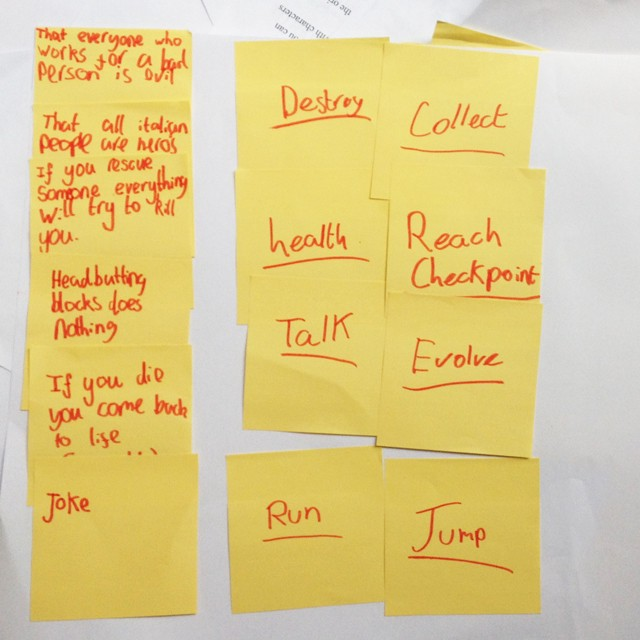
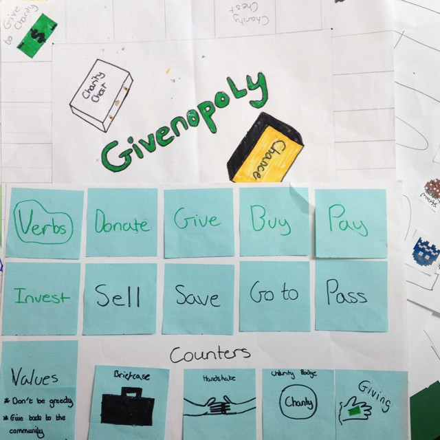
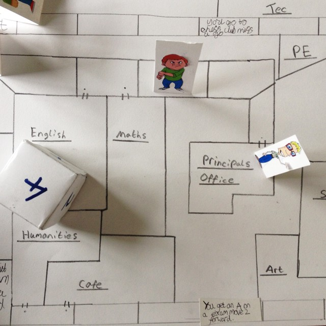
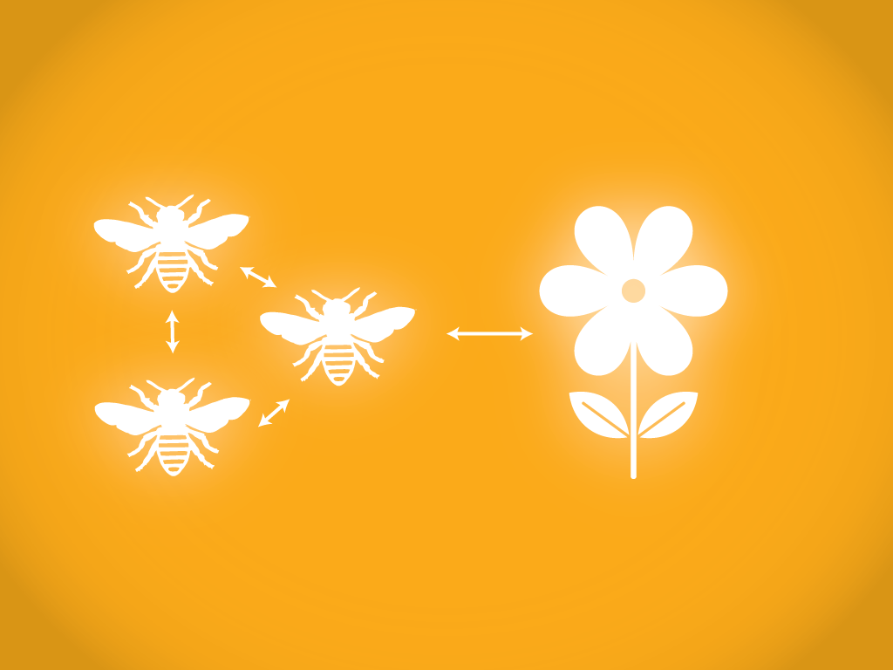
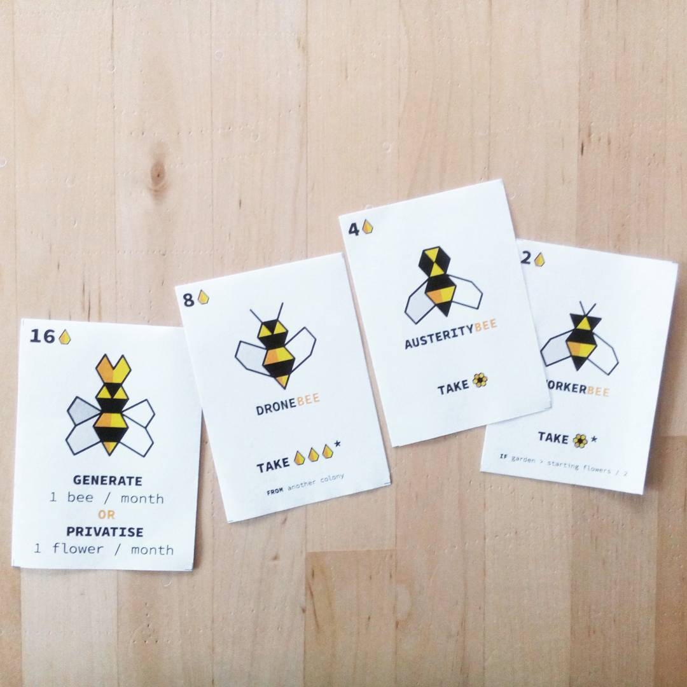
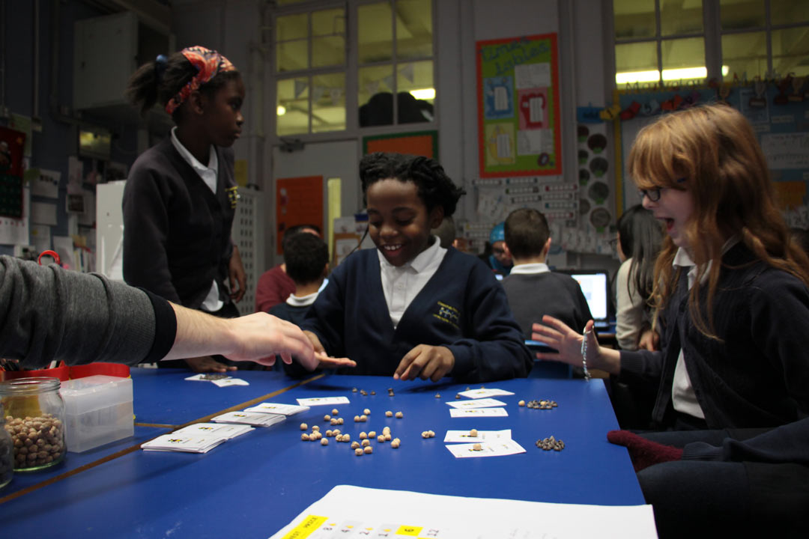

<!--
- Outside of WL, what other systems would you like to teach through game-hacking?
- Make it as interactive as possible, ask lots of questions
- Use Beesness as a case study, keep prompting people on how they would apply this to their teaching practice.
--> 

# Learning by ~~playing~~ making games

### Nice to meet you!

* Who are you?
* Why are you here?

### Why are we doing this?

There's a movement devoted to sparking fun and engagement in dull subjects or inconvenient tasks, but this is **not a session about gamification**. The aim here is not to make maths (or any other subject) fun by turning it into a game.

Instead, I want to share my experience using **game-making as a teaching method**. I spent some time asking students to make games about something they wanted to (or had to) learn. I believe that by making games, students gain valuable skills (researching, planning, prototyping, testing...) and the conceptual tools to make sense of the complex world around them (aka *system thinking*).  

The goal of this session is to come up with **game-making workshop ideas**, which **educators like you** can use to facilitate the learning of a theme / skill.

# 1. Hacking...

#### Can we understand hacking as a *neutral*, or even *positive* practice? 

Hacking intended as the practice of *modifying* something, possibly to *improve* it.

> Whatever code we hack, be it programming language, poetic language, math or music, curves or colourings, we create the possibility of new things entering the world. Not always great things, or even good things, but new things.

> [A Hacker Manifesto](http://subsol.c3.hu/subsol_2/contributors0/warktext.html) by Mackenzie Wark

#### A hacker practices creativity as *hacking the new out of the old*

A hacker is intellectually curious, a critical thinker who is not afraid of subverting systems to her own needs, responding to the principles of the communities she belongs to.

In that sense, our challenge as educators today is to help learners become the *hackers*, instead of the mere *consumers*, of technology.

# 2. Hacking games...

Many of your students are avid *consumers* of games, especially video games. 

**Making** (as opposed to consuming) games is the key. 

I'm a big fan of *learning by doing*. More precisely, Seymour Papert's [constructionism](https://en.wikipedia.org/wiki/Constructionism_(learning_theory)).

> Learning can happen most effectively when people are active in *making tangible objects* in the real world.

<!--
To make a game you need to *research* the subject of your game, you need to **conceptualise a system** of players, resources and rules, and then define how they all interact. 

The process involves *planning*, *testing*, *evaluating* feedback and *iterating* your prototype. 

And once you've made a game, you'll start playing other games *critically*.
-->

## How does one *hack a game*?

Let's hack [rock-paper-scissors](http://en.wikipedia.org/wiki/Rock-paper-scissors).

Some ideas:

* **Add** or **remove** one element
* **Rename** the elements
* Change the **number of players** 
* Change the **rules** 
* Use the rest of the **body** (not just hands)
* Use **noises** or smells (not only visual signs)
* Is there a **strategy** to win this game?
* What do you **know** about the other player's strategy?
* What if you change the **goal** of the game?
* Can you turn it into a **collaborative** game? 

<!-- 

Abstracting: A beats B, B beats C, and C beats A
 
Japanese mushi-ken: frog, slug & snake
Kitsune-ken: fox, mayor, hunter
Malaysia: bird, water, stone

Balance:
As long as the number of moves is an odd number and that each move defeats exactly half of the other moves while being defeated by the other half, any combination of moves will function as a game. 
 
Psychology? 
Attack and defence
Chance or pattern recognition?

Simultaneous decision game

Zero-sum game: wins for the winner are equal to the losses for the loser

-->

## What can we hack? 

One way to understand games is to analyse their **mechanics**, **dynamics** and **aesthetics** (aka the [MDA framework](assets/mda.pdf)

1. **Mechanics** are the *rules* of a game.
* **Dynamics** what players tend to do in order to reach their game goals. 
* **Aesthetics** are what players experience and feel while playing.

For example, in *Chess* 

1. *Mechanics*: if your king is put into check, you are  forced the move it out of check
* *Dynamics*: you may start your game with pawns, then as the board clears, shift your focus on more powerful elements (there isn't a rule that forces you to do that, but you may have noticed it's a better strategy)
* *Aesthetics*: you play the role of a medieval commander, trying to outsmart your opponent in an open battle between two armies
 
**Mechanics shape dynamics, which in turn shape aesthetics.**

As game makers, we can hack the rules of the game, but we can't control how players will interpret those rules and whether they'll have fun playing. Like *policy-makers*, we can only encourage / enforce certain behaviours, but we can't be sure people will behave like we envisioned. 

We create a **system of mechanics** but we do not directly create the player's experience. 

### As educators ... 

We control the *mechanics* of the learning environment (we can set the rules and promote certain behaviours), but we can't learn on behalf of others :) 

It's a **conversation** and game-making can facilitate that.

For example, [a couple of years ago](https://medium.com/@baddeo/every-child-is-a-game-designer-982d15aed199) we asked young people (12-16) to pick a game they play and *hack it* with new rules, new goals and new messages. 

They kicked off by listing the *verbs* of their chosen game, and discussing the values that these verbs may convey.

Then they introduced a new set of verbs, so that their game would express their own messages and values.

Kids came up with great ideas, such as a game about bullying at school, and a hack of [Snake](https://en.wikipedia.org/wiki/Snake_(video_game)) which promotes healthy eating.

You can find [more examples here](https://medium.com/@baddeo/every-child-is-a-game-designer-982d15aed199).

## Games as *systems*

Another way to understand games is to analyse them as systems.

We often use the word `system` to talk about very different things: the solar system, the operating system, the prison system, the ecosystem...

A system is a **set of interconnected things that work together to achieve something**. To use a common catchphrase:

> The whole is more than the sum of its parts.

In a system elements have **interactions** and **interdependencies**.

You can't understand an ecosystem just by analysing one part of it (eg: only a bee). Likewise, you can't make sense of human systems just by looking at the behaviour of individual *players*.

Games are often inspired by real world systems, which they generally simplify to make them playable.

> By making games we can take a step out of the social systems we inhabit, conceptualise them as a whole, identify the conflicting forces in play, and envision better **systems**.

> [Designing games to understand complexity](misc/games-as-systems.md) by Paolo Pedercini

**Through game-hacking, we can promote system literacy.**

So I prototyped a game about the system of our times: *capitalism*.

The working title is *Beesness*. 

* As a player, you control a *bee colony*. 
* All colonies operate in the *garden of Commons*. 
* Throughout the game, you can deploy different *beesness models*: from converting flowers’ nectar into honey, to stealing other colonies’ honey, privatising flowers and other nasty moves.
* Your goal is to have the most *honey* at the end of the year.

While the game mechanics are (still) clunky and the rules a little foggy, my preliminary tests with primary school children indicate that it can be an effective way to introduce tough questions like *How does our economy work?* and *What can we do to avoid running our of flowers?*

I presented kids with a paper-prototype and encouraged them to hack the game with new rules. They started negotiating *tweaks* and *fixes*, persuading each other and explaining how those changes would fit with the game logic.   

### Feedback loops

We commonly use `feedback` as a synonym for *comment* or *suggestion*.

[Technically speaking](https://en.wikipedia.org/wiki/Feedback) a feedback is the **output** of a system, which is fed back into the **input** and **conditions** it.

**Feedback loops** are a crucial aspect of all systems: 

* **Balancing loops**   
  	
  	We can spot these in an ecosystem, where predators and preys populations balance each other.
	
	<!-- *Demand and supply* is another example of a balancing loop. -->
	
	In *Beesness* the extraction of flowers is balanced by flowers re-planting at every turn.

* **Reinforcing loops**   
  
  	A reinforcing loop is one in which an action produces a result which influences more of the same action, resulting in growth or decline. The *rich gets richer*, the *powerful gets more power* and so on.
  	
	Reinforcing loops are built into many games (*Monopoly*, *Chess*, *Settlers of Catan*, *Risk*) because we want games to have winners and losers. In *Beesness*, when a player starts growing their colony, they are compelled to keep growing it. 
	
	Sometimes reinforcing loops lead to **escalation** (e.g. when you argue with someone) or to the **[tragedy of the commons](https://en.wikipedia.org/wiki/Tragedy_of_the_commons)**. These two are also built into *Beesness*, and players are challenged to find solutions by hacking the game mechanics. 
  
	Can you think of ways to counter **reinforcing loops**, both in games and IRL? 
	
	<!-- 
	- Limiting the rewards (antitrust)
	- Balancing systems (taxes, affirmative action)
	- Levelling the competition (debt cancellation, tax inheritance, meritocracy and access)
	-->

# 3. Hacking games to teach Web Literacy

Now that we dipped our toes into *game hacking* and *system thinking*, how can we apply these to Web Literacy?

### The problem

> Since the mid-1990s more and more products, services and scenes from everyday life have moved online. The Open Web that Mozilla believes in so strongly is now **under attack from a variety of forces**.

> From the [Mozilla Webmaker white paper](https://mozilla.github.io/webmaker-whitepaper/) 

### What is Web Literacy?

> The DIY potential for **connected**, **participatory**, **improvisational learning** requires new skills, what many are calling new *literacies*.

> Just what is it that people should be getting better at to avoid being stuck in the trap of *elegant consumption*?

> Web Literacy is the skills and competencies needed for reading, writing, and participating on the Web.

### Your turn 

In small teams:

1. Play with the [game-hacking idea generator](http://bit.ly/weblit-hacktivity-ideas-generator) to come up with a **game-hacking workshop idea**! 
3. Explain to the rest of us how you envision it working with a group of learners.
4. Share your idea on the [session etherpad](https://public.etherpad-mozilla.org/p/mozfest-2016-hacking-games-to-teach-web-literacy).

### License

This work is licensed under a [Creative Commons Attribution-NonCommercial-ShareAlike 4.0 International License](http://creativecommons.org/licenses/by-nc-sa/4.0)

